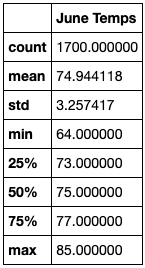
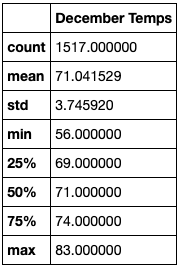

# Surfs Up

## Purpose
This analysis evaluates the differences in temperatures between June and December in Oahu to determine if the surf and ice cream shop business is sustainable year-round.

## Results
Here are the June temperatures: 

Here are the December temperatures: 

Here are the key differences in weather between June and December: 
1. The average temperature in June is 75 degrees fahrenheit, and the average temperature in December is 71 degrees fahrenheit. 
2. The minimum temperature in June is 64 degrees fahrenheit, and the minimum temperature in December is 56 degrees fahrenheit. 
3. The maximum temperature in June is 85 degrees fahrenheit, and the maximum temperature in December is 83 degrees fahrenheit.

## Summary
The surf and ice cream shop business in Oahu is sustainable year-round based on the temperature results above. The average, minimum, and maximum temperatures remain consistent between June and December. To further evaluate the sustainability of the surf and ice cream shop business in Oahu, two additional queries should be performed: (1) precipitation data for June and December and (2) wave height data for June and December. 
